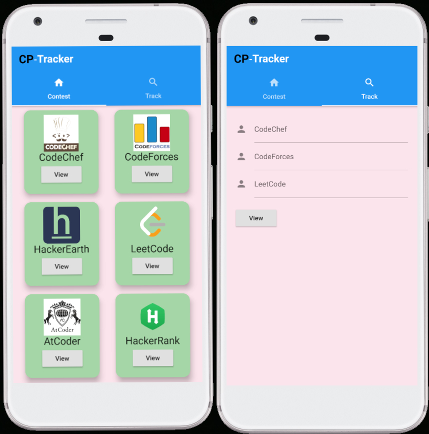
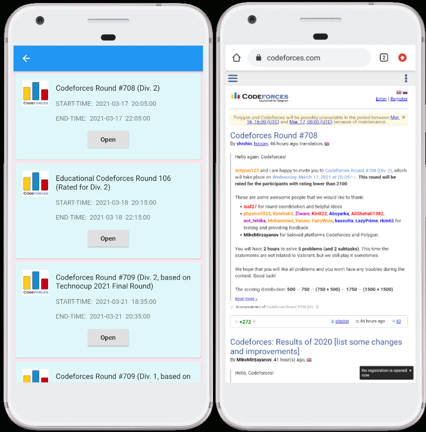
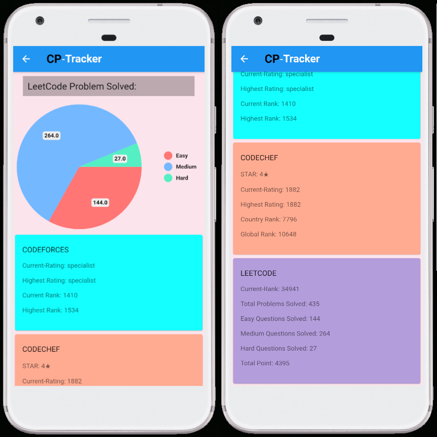

# CP-TRACKER APP

 
<ul style="font-family: 'Times New Roman', Times, serif;">
    <li>
        <h3>It allows user to view details of live/upcoming programming contest in different platform like
        <i>CodeChef, CodeForces, Leetcode,</i> etc.</h3>
    </li>
    <li>
        <h3>User can track their progress like number of problems they solved,about their Rating and Ranking, etc. in
        different Coding platforms.</h3>
    </li>
</ul>

# Screenshot- 

 
 

 
 

